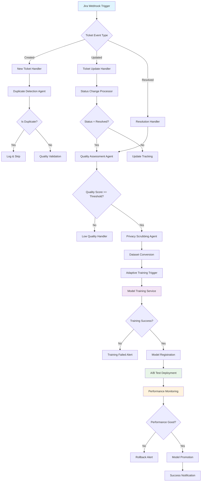

# N8N Workflow Design for Adaptive Jira Defect Analysis

## Overview

The n8n workflow orchestrates the entire adaptive fine-tuning pipeline, from detecting new Jira tickets to deploying updated models. This automation ensures continuous learning without manual intervention.

## Workflow Architecture



## Detailed Node Structure

### 1. **Trigger Nodes**
```
┌─────────────────────────┐
│   Jira Webhook Trigger  │
│                         │
│ • URL: /webhook/jira    │
│ • Method: POST          │
│ • Events: created,      │
│   updated, resolved     │
└─────────────────────────┘
```

### 2. **Event Processing Nodes**
```
┌─────────────────────────┐    ┌─────────────────────────┐    ┌─────────────────────────┐
│    Event Router         │    │   Duplicate Detector    │    │   Quality Validator     │
│                         │    │                         │    │                         │
│ • Parse webhook data    │    │ • Similarity check      │    │ • Description length    │
│ • Extract issue type    │    │ • Vector comparison     │    │ • Content quality       │
│ • Route by event        │    │ • Threshold: 0.85       │    │ • Min score: 0.6        │
└─────────────────────────┘    └─────────────────────────┘    └─────────────────────────┘
```

### 3. **Data Processing Agents**
```
┌─────────────────────────┐    ┌─────────────────────────┐    ┌─────────────────────────┐
│   Privacy Scrubber      │    │   Dataset Converter     │    │   Training Orchestrator │
│                         │    │                         │    │                         │
│ • Remove PII            │    │ • Jira → Instruction    │    │ • Call training script  │
│ • Sanitize data         │    │ • Multiple formats      │    │ • Monitor progress      │
│ • Log scrubbed items    │    │ • Quality validation    │    │ • Handle failures       │
└─────────────────────────┘    └─────────────────────────┘    └─────────────────────────┘
```

### 4. **Model Management Nodes**
```
┌─────────────────────────┐    ┌─────────────────────────┐    ┌─────────────────────────┐
│   Model Registrar       │    │   A/B Test Manager      │    │  Performance Monitor    │
│                         │    │                         │    │                         │
│ • Register new model    │    │ • Traffic splitting     │    │ • Accuracy tracking     │
│ • Version management    │    │ • Gradual rollout       │    │ • Response time         │
│ • Metadata storage      │    │ • Health checks         │    │ • User satisfaction     │
└─────────────────────────┘    └─────────────────────────┘    └─────────────────────────┘
```

### 5. **Notification & Alerting**
```
┌─────────────────────────┐    ┌─────────────────────────┐    ┌─────────────────────────┐
│   Success Notifier      │    │   Failure Alert         │    │   Performance Alert     │
│                         │    │                         │    │                         │
│ • Slack/Teams/Email     │    │ • Training failures     │    │ • Model degradation     │
│ • Model deployment      │    │ • Quality issues        │    │ • Rollback triggers     │
│ • Performance metrics   │    │ • System errors         │    │ • Threshold breaches    │
└─────────────────────────┘    └─────────────────────────┘    └─────────────────────────┘
```

## N8N Installation Guide

### Option 1: Docker Installation (Recommended)

```bash
# Create directory for n8n data
mkdir n8n-data

# Run n8n with Docker
docker run -it --rm \
  --name n8n \
  -p 5678:5678 \
  -v $(pwd)/n8n-data:/home/node/.n8n \
  n8nio/n8n

# Or with docker-compose
cat > docker-compose.yml << EOF
version: '3.8'
services:
  n8n:
    image: n8nio/n8n
    ports:
      - "5678:5678"
    volumes:
      - n8n_data:/home/node/.n8n
    environment:
      - N8N_BASIC_AUTH_ACTIVE=true
      - N8N_BASIC_AUTH_USER=admin
      - N8N_BASIC_AUTH_PASSWORD=changeme
      - WEBHOOK_URL=http://localhost:5678/

volumes:
  n8n_data:
EOF

docker-compose up -d
```

### Option 2: NPM Installation

```bash
npm install n8n -g
n8n start
```

### Option 3: Local Development Setup

```bash
# Clone n8n repository for custom development
git clone https://github.com/n8n-io/n8n.git
cd n8n
npm install
npm run build
npm start
```

## Workflow Configuration Files

### Main Workflow JSON Structure
```json
{
  "name": "Adaptive Jira Defect Analysis",
  "nodes": [
    {
      "name": "Jira Webhook",
      "type": "n8n-nodes-base.webhook",
      "parameters": {
        "path": "jira-webhook",
        "httpMethod": "POST"
      }
    },
    {
      "name": "Event Router",
      "type": "n8n-nodes-base.switch",
      "parameters": {
        "rules": {
          "rules": [
            {
              "operation": "equal",
              "value1": "={{ $json.issue_event_type_name }}",
              "value2": "issue_created"
            },
            {
              "operation": "equal", 
              "value1": "={{ $json.issue_event_type_name }}",
              "value2": "issue_updated"
            }
          ]
        }
      }
    }
  ],
  "connections": {},
  "settings": {
    "saveExecutionProgress": true,
    "saveManualExecutions": true
  }
}
```

## Custom Node Development

You may need custom nodes for specific functionality:

### 1. **Adaptive Training Node**
```javascript
// nodes/AdaptiveTraining/AdaptiveTraining.node.ts
export class AdaptiveTraining implements INodeType {
  description: INodeTypeDescription = {
    displayName: 'Adaptive Training',
    name: 'adaptiveTraining',
    group: ['ml'],
    version: 1,
    description: 'Trigger adaptive model training',
    defaults: {
      name: 'Adaptive Training',
    },
    inputs: ['main'],
    outputs: ['main'],
    properties: [
      {
        displayName: 'Training Mode',
        name: 'mode',
        type: 'options',
        options: [
          { name: 'Single Ticket', value: 'single' },
          { name: 'Batch', value: 'batch' },
          { name: 'Recent', value: 'recent' }
        ],
        default: 'single'
      }
    ]
  };
}
```

### 2. **Model Manager Node**
```javascript
// nodes/ModelManager/ModelManager.node.ts
export class ModelManager implements INodeType {
  description: INodeTypeDescription = {
    displayName: 'Model Manager',
    name: 'modelManager',
    group: ['ml'],
    version: 1,
    description: 'Manage model deployments and A/B tests'
  };
}
```

## Environment Variables for N8N

```bash
# Add to .env
N8N_HOST=localhost
N8N_PORT=5678
N8N_PROTOCOL=http
N8N_BASIC_AUTH_ACTIVE=true
N8N_BASIC_AUTH_USER=admin
N8N_BASIC_AUTH_PASSWORD=secure_password

# Webhook URL for Jira
WEBHOOK_URL=http://localhost:5678/webhook/jira-webhook

# Integration with our system
ADAPTIVE_SYSTEM_URL=http://localhost:8000
ADAPTIVE_SYSTEM_API_KEY=your_api_key_here
```

## Workflow Execution Flow

### 1. **New Ticket Created**
```
Jira Webhook → Event Router → Duplicate Check → Quality Check → Privacy Scrub → Queue for Training
```

### 2. **Ticket Resolved**
```
Jira Webhook → Resolution Handler → Quality Assessment → Dataset Conversion → Adaptive Training → Model Registration → A/B Deployment
```

### 3. **Performance Monitoring**
```
Scheduled Trigger → Performance Check → Metrics Collection → Threshold Evaluation → Alert/Promote Decision
```

## Integration Points

### Scripts Integration
The n8n workflow will call your Python scripts:

```bash
# Training trigger
python scripts/adaptive_training.py --mode single --ticket-key ${ticketKey}

# Model management
python scripts/system_monitor.py --action ab-test-evaluate

# Health checks
python scripts/system_monitor.py --action health-check
```

### API Endpoints
You may want to create a simple Flask API for n8n integration:

```python
# api_server.py
from flask import Flask, request, jsonify
from scripts.adaptive_training import main as train_main

app = Flask(__name__)

@app.route('/train', methods=['POST'])
def trigger_training():
    data = request.json
    # Call training script
    result = train_main(data)
    return jsonify(result)

@app.route('/health', methods=['GET'])
def health_check():
    # System health check
    return jsonify({'status': 'healthy'})
```

## Monitoring Dashboard

The n8n workflow can also populate a monitoring dashboard showing:
- Training pipeline status
- Model performance metrics
- A/B test results
- System health indicators
- Recent ticket processing stats

Would you like me to create specific n8n workflow files or focus on any particular aspect of the integration?